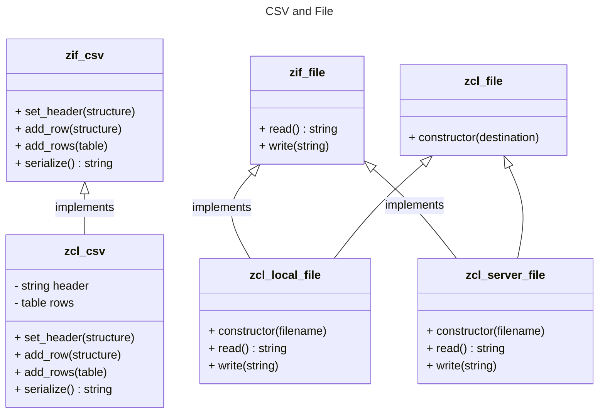

```mermaid
---
title: CSV and File
---
classDiagram
  class zif_csv{
      + set_header(structure)
      + add_row(structure)
      + add_rows(table)
      + serialize() string
  }
  class zif_file {
      + read()string
      + write(string)
  }
  class zcl_csv {
      - string header  
      - table rows  
      + set_header(structure)
      + add_row(structure)
      + add_rows(table)
      + serialize() string
  }
  class zcl_file {
      + constructor(destination)
  }
  class zcl_local_file {
      + constructor(filename)
      + read() string
      + write(string)
  }
  class zcl_server_file {
      + constructor(filename)
      + read() string
      + write(string)
  }

  zif_csv <|-- zcl_csv : implements
  zif_file <|-- zcl_local_file : implements
  zif_file <|-- zcl_server_file : implements
  zcl_file <|-- zcl_local_file
  zcl_file <|-- zcl_server_file
```
